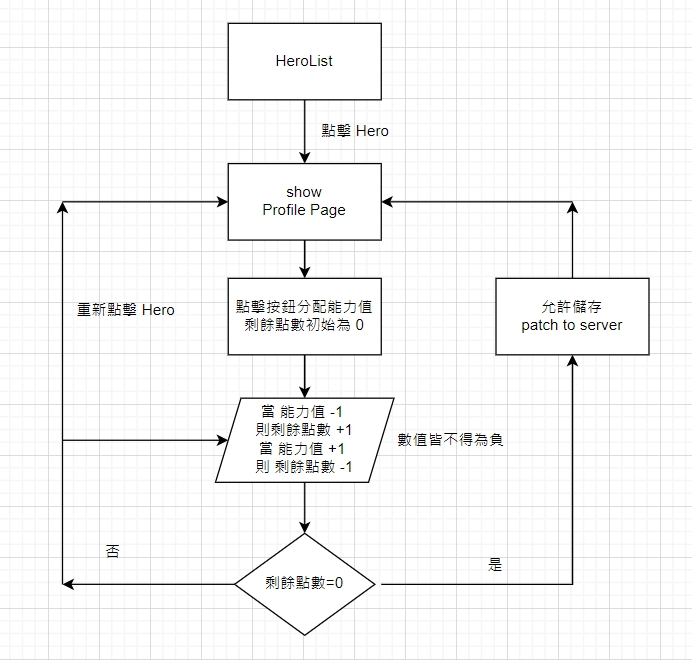

# HERO LIST

## Demo

**Demo Link**
[https://emilycodeee.github.io/heropageForHahow/#/heroes/](https://emilycodeee.github.io/heropageForHahow/#/heroes/)

## 安裝與執行

**1. 將專案存放至本機**

- git clone https://github.com/emilycodeee/heropageForHahow.git.

**2. 進入專案資料夾(heropage)使用終端機安裝相關套件**

```
npm install
```

**3. 安裝完成後，啟動專案伺服器，即可進行本機瀏覽**

```
npm start
```

**4. 透過瀏覽器瀏覽專案**

打開瀏覽器在網址列輸入 localhost:3000 即可瀏覽或直接進入上方 demo 連結

## 專案架構

- pages/home 資料夾

  - index.jsx <br>
    專案顯示入口檔案，設定 heros 之巢狀路由。
  - components 資料夾<br>

    - HeroCard.jsx <br>
      顯示 hero list 名稱、圖片之共用組件，點擊將透過 router 顯示相應 profile 能力值。
    - Profile.jsx<br>
      顯示所選 hero 之能力值，並可點擊按鈕調整能力值，當剩餘點數分配完成，即可送出儲存。

    - Button.jsx<br>
      調整能力值之按鈕共用組件，useCounter 共用點數計算與連動剩餘點數計算之操作邏輯。

- hooks 資料夾

  - useCounter.jsx <br>
    分配能力值按鈕與剩餘點數之邏輯運算。
  - useLoading.jsx <br>
    控制 loading 動畫開啟與關閉之狀態。

- utils 資料夾
  - common.js <br>
    api 網址統一儲存，避免 api 網址更新要更動多個檔案，宣告能力值屬性陣列。

#### Web 的架構邏輯



## 第三方 library 運用

#### react-loading

https://www.npmjs.com/package/react-loading

loading 的簡易動畫套件，雖然最新一次維護是三年前，但仍是目前單月下載量最多的 loading 快捷動畫，在做其他練習小專案的時候也常使用這個套件。

基本上，可以像是引入 component 一樣使用，若想調整動畫的高、寬、顏色，可以依 document 指示調整。並也可以調整動畫速度、或加上 className 。

#### styled-components

https://styled-components.com/

就我個人的理解，我認為 CSS in JS 有以下優點，可以像寫程式一樣寫 CSS，宣告變數、動態控制(props)、不用煩惱 class 取名問題、解決 code spliting 可能出現的順序問題等，並且也因為元件化，而像我們一開始就訂好元件樣式被影響的邊界，不用像原本 CSS 檔案那樣，可能因為彼此影響與覆蓋而發生不如預期的顯示錯誤。

但缺點部分則是可能會讓元件看起來很長，因此我都會特別把 style 檔案分別拆出去，但這也要謝謝 vscode 可以點擊變數直接連結至該變數內容，不然查找起來應該會蠻痛苦的。

另一點是複用性，雖然元件切小可以共用，但相較原本 CSS 可以透過選擇器讓指定的屬性或 TAG 一次使用同樣的樣式，CSS in Js 在這點要實現就比較困難，但也因為是 CSS in JS ，仍然可以宣告共用的物件來層層覆蓋。

範例如下，這個用法在個人專案 shareMore 有使用，但在 heroPage 則沒有用上。

```
//宣告物件
const IconStyle = {
  fontSize: "2rem",
  cursor: "pointer",
  color: "#f27e59",
};

//引用物件
const RevertIcon = styled(BiUndo)`
  ${IconStyle}
  font-size: 2rem;
  margin: 10px 0;
`;
```

## 撰寫註解原則

最初開始寫程式碼時，都會在 function 寫上說明此 function 的簡短註解，但後來發現，如果能在定義變數、函式名稱時，就讓名稱清楚明瞭，似乎也就沒有寫註解的必要了(因為名稱本身已經說明了動作)，因此後來逐漸改掉了寫註解的習慣，但也或許這是目前多屬獨立開發，若是加入團隊開發，則要依該團隊註解文化為主。

但若遇到特殊情境，或需要特別說明的情境也會加上類似筆記意涵的註解，例如部屬至 github 時遇到的 router 問題。

## 在專案中遇到的困難、問題及解決方法

#### 取得最終能力值總數

在最後要點選儲存按鈕，將物件 patch 出去時，因為分數計算在 button component(子 component)，一開始直覺想用四個 useRef 傳下去給每個按鈕的 dom 節點，抓取個別點數，當時還找了 map 產生 useRef 的方法。但因為還是需要紀錄能力值的屬性名稱(ex: str:3 )，後來發現自己沒有把情境想完整，其實只要一個 useRef 並去更新物件值就可以了，並且用 useRef 也不會造成狀態的更新，符合情境。

#### 部屬至 github page

部屬至 github page 時，一開始只有原網址會顯示背景色，加上/heroes 卻會轉至 404 頁面，卡了很久，一直以為是我部屬錯誤，後來查資料才發現，原來跟 spa 路由有關係。

過往部屬 MPA 的網站，因為每個部份的 HTML 頁面都有一個相對檔案、相對路徑，因此瀏覽器知道去哪邊加載檔案，但因為 SPA 是處於同一個 HTML ，只是依操作在同一份 HTML 抽換內容(SPA)，而我們之所以能使用 BrowserRouter 設定路由，是因為它使用 HTML5 的 history API。

這在本地瀏覽器 localhost 運行一切正常，但推到 GitHub 就找不到了，是因為 GitHub 不像瀏覽器那樣能夠支援 history ，所以要把`BrowserRouter`改成`HashRouter` ，才能幫助 GitHub Pages 了解將用戶指向哪裡（因為它是前端路由）
